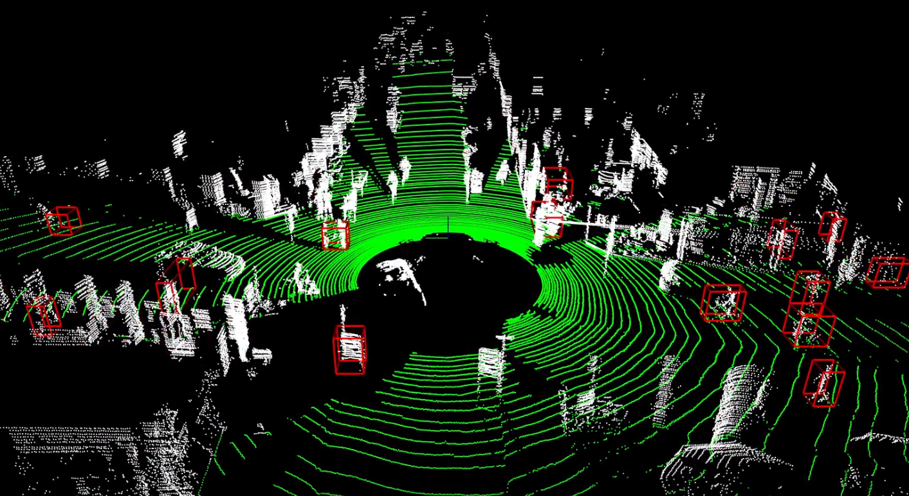

# pointcloud-clustering-detector-cuda
A CUDA-accelerated point cloud clustering detector for real-time 3D perception. The work is currently under development.

  

## 🚀 Overview
This repository contains a point cloud clustering and detection system. The goal is to accelerate the core clustering algorithm using NVIDIA's CUDA to achieve real-time performance, a crucial requirement for dense point cloud data from sources like LiDAR.

### **Current Features**

The current CPU-based version of the pipeline includes:
* **Ground Removal:** An algorithm to remove ground planes from the point cloud to isolate objects of interest.
* **Clustering Detector:** A clustering algorithm to group points belonging to the same object.
* **Bounding Box Visualization:** The ability to visualize the detected clusters as 3D bounding boxes.

### **CPU vs. GPU Performance**
A key motivation for this project is to address the performance limitations of CPU-based clustering algorithms. My initial tests show that the speed of the CPU version is highly dependent on the volume and density of the input point cloud. As demonstrated in this [video](https://youtu.be/ickDlyV1Nuk), the algorithm is too slow for dense inputs, making it unsuitable for real-time applications.

## 🛠️ To-Do

### **CUDA Acceleration**
The core development effort will focus on implementing a highly parallelized clustering algorithm in CUDA. This will leverage the GPU's massive parallelism to process dense point clouds significantly faster than the CPU version.

### **Bounding Box Confidence**
The system will be enhanced to provide a **confidence score** for each detected bounding box. This metric will indicate the reliability of the detection, which is vital for downstream tasks. The confidence score will be based on parameters such as the number of points within the box, the density of the cluster, or other relevant features.

### **Optimized Detection Filter**
The current detection filter will be optimized to improve accuracy and reduce false positives. This involves fine-tuning the algorithm that identifies and validates clusters as objects.

### **Overall Speed Optimization**
In addition to CUDA acceleration, the entire processing pipeline will be optimized for maximum throughput. This includes improvements to data loading, memory management (e.g., using shared memory and ensuring memory coalescing), and other algorithmic enhancements to minimize latency.
